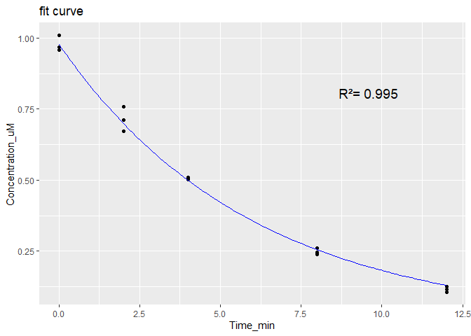

<!-- README.md is generated from README.Rmd. Please edit that file -->

# esqIVIVE

<!-- badges: start -->

[](https://github.com/esqLABS/esqIVIVE/actions/workflows/R-CMD-check.yaml)
[](https://github.com/esqLABS/esqIVIVE/actions/workflows/pkgdown.yaml)
<!-- badges: end -->

The goal of esqIVIVE is to perform extrapolation of in vitro ADME
parameters and derive ADME parameters to input for PBK models.

The functions in this package have been developed focusing on the
integration with OSP tools.

Currently there are available codes to calculate: fraction unbound in
microsomes :

- calculate_fu_mic_austin()

- calculate_fu_mic_halifax()

- calculate_fu_mic_turner()

fraction unbound in hepatocytes:

- calculate_fu_hep_austin()

- calculate_fu_hep_kilford()

- calculate_fu_hep_poulin()

derive metabolism parameters from experimental curves:

- fit_clearance_from_curve()

- fit_mm_from_curve()

perform scaling for clearance:

- IVIVE_clearance()

- IVIVE_MM()

calculate fu_plasma related parameters:

- calculate_fu_pls_from_Ks()

- predict_plasma_affinities()

- correct_fu_pls_pearce()

perform IVIVE to derive Pint:

- pint_caco2_empir()

- pint_peff_empir()

Examples of how to use the functions are provided for each.

## Installation

You can install the development version of esqIVIVE from
[GitHub](https://github.com/) with:

``` r
# install.packages("devtools")
devtools::install_github("esqLABS/esqIVIVE")
```

## Example: clearance IVIVE workflow for midazolam

This example derives the PK-Sim specific clearance of midazolam from a
human liver microsome (HLM) incubation in three steps:

1.  Predict the fraction unbound in the microsomal incubation (fu_mic)
    and compare it with measured values.
2.  Fit the depletion rate constant from the raw concentration-time
    data.
3.  Scale the in vitro rate constant to an in vivo specific clearance.

The compound properties and the incubation conditions (1 mg/mL
microsomal protein, in vitro half-life of 3.9 min) are from Obach
(1999), Drug Metab Dispos 27(11):1350-1359.

``` r
library(esqIVIVE)

midazolam <- list(
  log_lipophilicity = 3.38, # logP at 37 C
  ionization = c("neutral", 0),
  pka = c(0, 0),
  fu_plasma = 0.05,
  blood_plasma_ratio = 0.53,
  cMicro_mgml = 1 # microsomal protein concentration in the incubation
)
```

### 1. Fraction unbound in the incubation

`calculate_fu_in_vitro()` predicts fu_mic with different QSPRs.
`"All_literature"` is the average of the Poulin, Austin, Halifax and
Turner regressions.

``` r
fu_mic <- calculate_fu_in_vitro(
  partition_qspr = "All_literature",
  log_lipophilicity = midazolam$log_lipophilicity,
  ionization = midazolam$ionization,
  pka = midazolam$pka,
  type_system = "microsomes",
  FBS_fraction = 0,
  microplate_type = 96,
  volume_medium = 0.5,
  fraction_unbound = midazolam$fu_plasma,
  blood_plasma_ratio = midazolam$blood_plasma_ratio,
  concentration_microsomes = midazolam$cMicro_mgml
)
fu_mic
#> [1] 0.3907191
```

Measured values from the Krumpholz et al. database can be retrieved with
`get_fu_krumpholz()`. The values are averaged per species and microsomal
concentration, and `n` is the number of values averaged:

``` r
get_fu_krumpholz("Midazolam", system = "microsomes", species = "human")
#>     compound species concentration_mgml        fu n
#> 1  Midazolam   human              0.025 1.0000000 2
#> 2  Midazolam   human              0.050 1.0000000 1
#> 3  Midazolam   human              0.200 0.8500000 1
#> 4  Midazolam   human              0.250 0.7800000 2
#> 5  Midazolam   human              0.500 0.6191667 6
#> 6  Midazolam   human              0.710 0.8800000 1
#> 7  Midazolam   human              0.760 0.6500000 2
#> 8  Midazolam   human              1.000 0.6358750 8
#> 9  Midazolam   human              1.490 0.3360000 1
#> 10 Midazolam   human                 NA 0.6140000 3
```

### 2. Depletion rate constant from raw data

`fit_clearance_from_curve()` fits a mono-exponential decay to the
substrate depletion curve (time in min, concentration in µM). It returns
the rate constant (kcat, 1/min) with its 95% confidence interval and
plots the fit.

The data below are an illustrative depletion curve in triplicate,
generated from the midazolam half-life of 3.9 min.

``` r
depletion <- data.frame(
  Time_min = c(0, 0, 0, 2, 2, 2, 4, 4, 4, 8, 8, 8, 12, 12, 12),
  Concentration_uM = c(
    0.969, 1.009, 0.959, 0.759, 0.712, 0.673, 0.503, 0.510, 0.506,
    0.238, 0.260, 0.246, 0.115, 0.106, 0.125
  )
)

kcat <- fit_clearance_from_curve(depletion)
```



``` r
kcat
#> Mean_kcat_min-1    2.5%_CI_kcat     95%_CI_kcat 
#>       0.1683673       0.1607129       0.1764242

# in vitro half-life (min)
log(2) / kcat[["Mean_kcat_min-1"]]
#> [1] 4.116874
```

### 3. IVIVE to the PK-Sim specific clearance

`IVIVE_clearance()` scales the in vitro rate constant with the
microsomal protein per gram liver and the intracellular fraction of the
liver, and corrects it for fu_mic. The result is the specific clearance
(1/min) to use in the PK-Sim “Liver Plasma Clearance” process.

``` r
IVIVE_clearance(
  typeValue = "kcat",
  units = "/minutes",
  expData = kcat[["Mean_kcat_min-1"]],
  typeSystem = "microsomes",
  fu_invitro = fu_mic,
  cProtein_mgml = midazolam$cMicro_mgml
)
#> ClspePermin 
#>    23.15373
```

If only the in vitro half-life is reported, it can be used directly:

``` r
IVIVE_clearance(
  typeValue = "halfLife",
  units = "minutes",
  expData = 3.9,
  typeSystem = "microsomes",
  fu_invitro = fu_mic,
  cProtein_mgml = midazolam$cMicro_mgml
)
#> ClspePermin 
#>    24.43609
```

The vignette `Clearance IVIVE check` applies this workflow to the 28
drugs of Obach (1999). It simulates their in vivo clearance with PK-Sim
PBK models and compares the different IVIVE options.

## Contribute

### Coding Standards

Contributors should comply with the [Open Systems Pharmacology Coding
Standards for
R](https://github.com/Open-Systems-Pharmacology/developer-docs/blob/main/ospsuite-r-specifics/CODING_STANDARDS_R.md)

### Development Environment

To install all the dependencies required for development, run:

``` r
renv::install()
```

### Testing

(Not function yet) To run packages tests, execute

``` r
devtools::test()
```

### Website

With Quarto and the `ospsuite`/PK-Sim system prerequisites installed, run from
the package root:

```sh
Rscript dev/build-website.R
```

The script installs pkgdown, the package, and its dependencies, including
`DESCRIPTION`'s `Config/Needs/website`, before building the website.

The Quarto documents in `vignettes/articles/` are pkgdown articles, excluded
from the R package build. Rendering the clearance article additionally requires
`ospsuite` and PK-Sim. Generated HTML, supporting files, and results are ignored.
