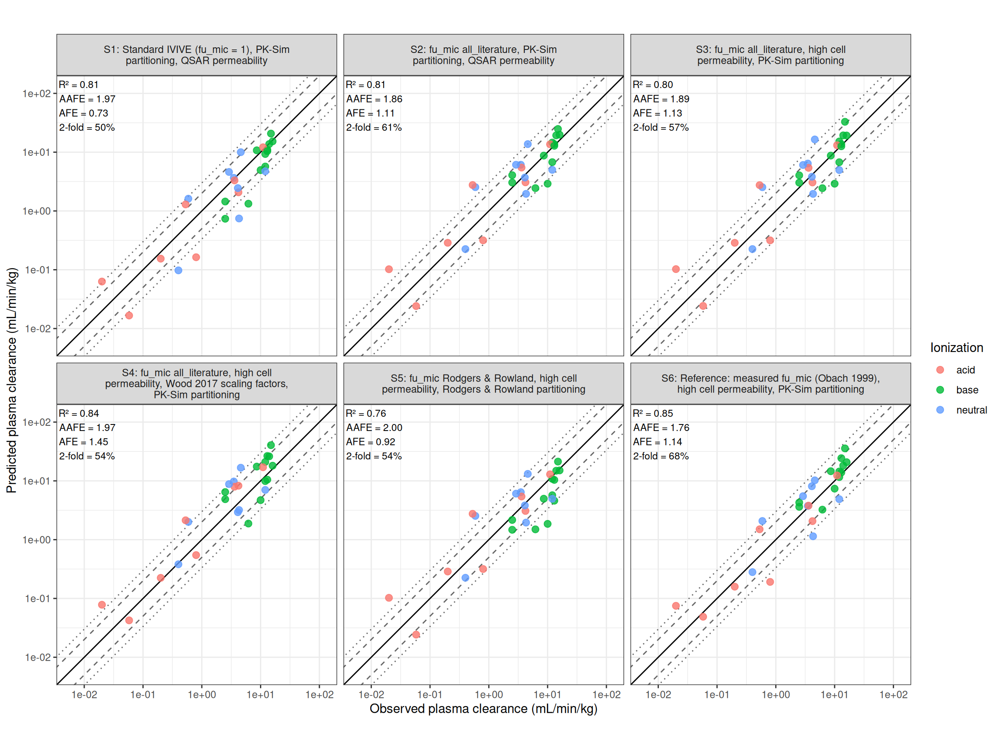
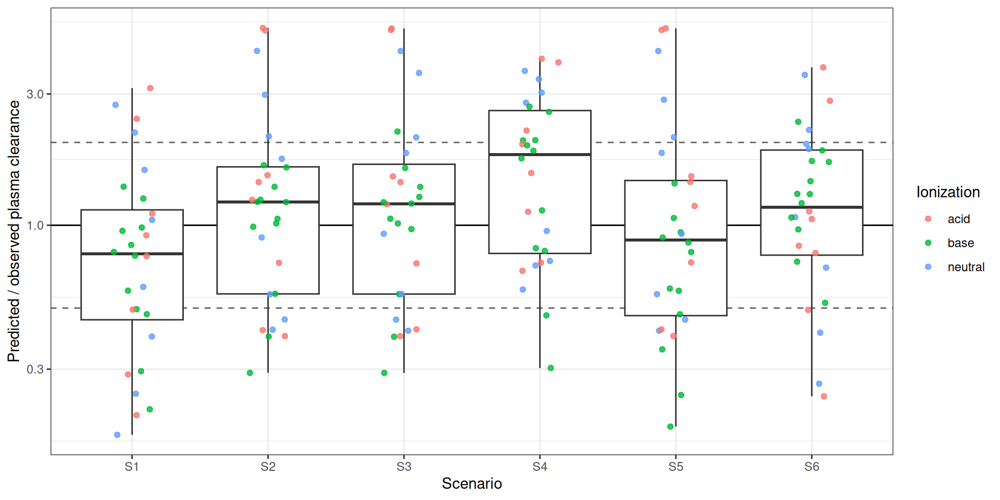

# Test for clearance IVIVE

## Introduction

This vignette showcases and compares different IVIVE frameworks for
clearance, and evaluates how the clearance predicted with the standard
PK-Sim PBK model compares with observed plasma clearances. In vitro
metabolism data are converted with `esqIVIVE` into a PK-Sim specific
clearance, which is then simulated in batch mode with the `ospsuite` R
package using the PBK models in `inst/extdata/pkml4htpbk`.

The scenarios to run and the simulation time can be set in the YAML
header (`params`) or from the command line at the package root,
e.g. `quarto render "vignettes/articles/clearance-ivive-check.qmd" -P scenarios:S1,S3,S5`.


#### Import data

Hepatic microsomal clearance data are taken from Obach (1999),
*Prediction of Human Clearance of Twenty-Nine Drugs from Hepatic
Microsomal Intrinsic Clearance Data: An Examination of In Vitro
Half-Life Approach and Nonspecific Binding to Microsomes*, Drug Metab
Dispos 27(11):1350-1359. For each drug the sheet holds the
physicochemical properties, the fraction unbound in plasma, the in vitro
half-life of substrate depletion, the microsomal protein concentration,
the measured fraction unbound in microsomes and the observed in vivo
plasma clearance.

The data are stored in the import sheet
`inst/extdata/Obach1999_IVIVE_input.xlsx`, which is built by
`dev/make_obach_ivive_sheet.R`. It has three sheets:

- `Compounds`: one row per drug.
- `Scenarios`: one row per IVIVE/PBK scenario. To test a new option, add
  a row here.
- `Columns`: description and unit of every column.

Code

``` r

input_file <- system.file("extdata", "Obach1999_IVIVE_input.xlsx", package = "esqIVIVE")
compounds <- as.data.frame(read_excel(input_file, sheet = "Compounds"))
scenarios <- as.data.frame(read_excel(input_file, sheet = "Scenarios"))

if (!identical(params$scenarios, "all")) {
  selected <- trimws(strsplit(params$scenarios, ",")[[1]])
  scenarios <- scenarios[scenarios$scenario %in% selected, ]
}

knitr::kable(scenarios)
```

| scenario | description | fu_mic_method | fu_mic_fallback | permeability | permeability_high_cmmin | empirical_scalar | blood_plasma_ratio | pkml |
|:---|:---|:---|:---|:---|---:|:---|:---|:---|
| S1 | Standard IVIVE (fu_mic = 1), PK-Sim partitioning, QSAR permeability | none | NA | QSAR | NA | No | observed | single-iv-pksim.pkml |
| S2 | fu_mic All_literature, PK-Sim partitioning, QSAR permeability | All_literature | NA | QSAR | NA | No | observed | single-iv-pksim.pkml |
| S3 | fu_mic All_literature, high cell permeability, PK-Sim partitioning | All_literature | NA | high | 1000 | No | observed | single-iv-pksim.pkml |
| S4 | fu_mic All_literature, high cell permeability, Wood 2017 scaling factors, PK-Sim partitioning | All_literature | NA | high | 1000 | Yes | observed | single-iv-pksim.pkml |
| S5 | fu_mic Rodgers & Rowland, high cell permeability, Rodgers & Rowland partitioning | Rodgers & Rowland + fu | All_literature | high | 1000 | No | observed | single-iv-rodgers-rowland.pkml |
| S6 | Reference: measured fu_mic (Obach 1999), high cell permeability, PK-Sim partitioning | measured | NA | high | 1000 | No | observed | single-iv-pksim.pkml |

### Make batch htpbk simulations with IV simulations using different options

1-Using standard IVIVE (fu_mic = 1) and tissue partitioning default
PK-Sim

2-Correcting for fu-All_literature and tissue partitioning default
PK-Sim

3-Correcting for fu-All_literature and a default high cell permeability
and tissue partitioning default PK-Sim

4-Correcting for fu-All_literature and a default high cell permeability
and Wood scaling factors and tissue partitioning default PK-Sim

5-Correcting for fu-R&R and a default high cell permeability and tissue
partitioning default R&R

6-(Reference) Correcting for the measured fu_mic from Obach (1999) and a
default high cell permeability and tissue partitioning default PK-Sim.
This shows how much of the error is due to the fu_mic prediction.

Scenarios 1 and 2 use the cell permeability calculated by the PK-Sim
QSAR, while scenarios 3 to 6 use a high cell permeability of 1000
cm/min, which makes the liver perfusion-limited.

#### IVIVE of the in vitro half-life

The in vitro half-life is scaled to a PK-Sim specific clearance (1/min,
per volume of liver intracellular space) with
[`IVIVE_clearance()`](https://esqlabs.github.io/esqIVIVE/reference/IVIVE_clearance.md):

``` math
CL_{spec} = \frac{0.693}{t_{1/2}} \cdot \frac{1}{C_{mic}} \cdot \frac{MPPGL}{f_{cell} \cdot fu_{mic}}
```

Where $`C_{mic}`$ is the microsomal protein concentration in the
incubation (mg/mL), $`MPPGL`$ the microsomal protein per gram of liver
and $`f_{cell}`$ the intracellular fraction of the liver. $`fu_{mic}`$
is either set to 1, taken from the measured values, or predicted with
[`calculate_fu_in_vitro()`](https://esqlabs.github.io/esqIVIVE/reference/calculate_fu_in_vitro.md).
Rodgers & Rowland is only implemented for strong bases, so for other
compounds the method in `fu_mic_fallback` is used. The column
`fu_mic_method_used` records which method was used for each compound.

The incubation volume and plate type only affect the predicted binding
to plastic, which is small for microsomes. They are not reported per
compound, so generic values are used.

Code

``` r

incubation_volume_mL <- 0.5
microplate_type <- 96


#function to predict fu_Mic by collecting the chemical input from table and input of the method
predict_fu_mic <- function(method, cmp) {
  if (is.na(method) || method == "none") {
    return(1)
  }
  if (method == "measured") {
    return(cmp$fu_mic_obs)
  }
  tryCatch(
    suppressWarnings(calculate_fu_in_vitro(
      partition_qspr = method,
      log_lipophilicity = cmp$LogP,
      ionization = c(cmp$Ionization, 0),
      type_system = "microsomes",
      FBS_fraction = 0,
      microplate_type = microplate_type,
      volume_medium = incubation_volume_mL,
      pka = c(cmp$pKa, 0),
      fraction_unbound = cmp$fu_plasma,
      blood_plasma_ratio = cmp$BP,
      concentration_microsomes = cmp$Cmic_mgml
    )),
    error = function(e) NA_real_
  )
}

# PK-Sim cell permeability QSAR (formula PARAM_P in the pkml), in cm/min
pksim_permeability_cmmin <- function(cmp) {
  mw_eff <- cmp$MW_gmol - 17 * cmp$F - 22 * cmp$Cl - 62 * cmp$Br - 98 * cmp$I
  (mw_eff / 336)^(-6) * 10^cmp$LogP / 5 * 1e-4
}

ivive_one <- function(scn, cmp) {
  fu_mic <- predict_fu_mic(scn$fu_mic_method, cmp)
  method_used <- scn$fu_mic_method
  if (is.na(fu_mic) && !is.na(scn$fu_mic_fallback)) {
    fu_mic <- predict_fu_mic(scn$fu_mic_fallback, cmp)
    method_used <- scn$fu_mic_fallback
  }

  #perfrom IVIVE with calculated fu
  cl_spec <- IVIVE_clearance(
    typeValue = "halfLife",
    units = "minutes",
    expData = cmp$halflife_min,
    typeSystem = "microsomes",
    fu_invitro = fu_mic,
    empirical_scalar = scn$empirical_scalar,
    species = "human",
    cProtein_mgml = cmp$Cmic_mgml
  )

  data.frame(
    scenario = scn$scenario,
    Drug = cmp$Drug,
    fu_mic_method_used = method_used,
    fu_mic = fu_mic,
    specific_clearance_permin = unname(cl_spec),
    permeability_cmmin = if (scn$permeability == "high") {
      scn$permeability_high_cmmin
    } else {
      pksim_permeability_cmmin(cmp)
    },
    pkml = scn$pkml
  )
}

ivive <- do.call(rbind, lapply(seq_len(nrow(scenarios)), function(s) {
  do.call(rbind, lapply(seq_len(nrow(compounds)), function(i) {
    ivive_one(scenarios[s, ], compounds[i, ])
  }))
}))

ivive %>%
  count(scenario, fu_mic_method_used) %>%
  knitr::kable()
```

| scenario | fu_mic_method_used     |   n |
|:---------|:-----------------------|----:|
| S1       | none                   |  28 |
| S2       | All_literature         |  28 |
| S3       | All_literature         |  28 |
| S4       | All_literature         |  28 |
| S5       | All_literature         |  16 |
| S5       | Rodgers & Rowland + fu |  12 |
| S6       | measured               |  28 |

#### Run the PBK batch simulations

All scenarios that share a pkml file are simulated in one
`SimulationBatch`. For every compound the molecular weight, halogens,
lipophilicity, fraction unbound in plasma, pKa and compound type are
set, together with the specific clearance and cell permeability from the
IVIVE step. The partition coefficients are recalculated by the formulas
in the pkml. The dose (1 mg/kg IV) is converted to µmol with the
molecular weight of the compound.

PK-Sim calculates the blood/plasma ratio from lipophilicity, which gives
unrealistically high values for lipophilic bases. Plasma clearance is
blood clearance times the blood/plasma ratio, so this would inflate the
predicted plasma clearance above liver blood flow. When
`blood_plasma_ratio = "observed"` in the scenario sheet, the blood
cell/plasma partition coefficient is therefore set from the measured
blood/plasma ratio.

The clearance is taken from the PK analysis (dose/AUC_(inf)). For
compounds with a large predicted volume of distribution, AUC_(inf) is
dominated by extrapolation after `sim_end_h`, and the terminal phase may
not have been reached yet. Runs with more than
`max_auc_extrapolated_percent` of AUC_(inf) extrapolated, or that
failed, are therefore repeated with a 10x and a 100x longer simulation.
Failed runs are also repeated with a 3x shorter simulation, because for
fast-cleared compounds the concentration can drop below the solver
tolerance, which breaks the terminal phase fit. The column `sim_end_h`
in the results reports the simulation time used.

Code

``` r

molecule <- "test_chemical"
clearance_process <- "test_chemical-Total Hepatic Clearance-different sources"
plasma_output <- "Organism|PeripheralVenousBlood|test_chemical|Plasma (Peripheral Venous Blood)"
pkml_dir <- system.file("extdata", "pkml4htpbk", package = "esqIVIVE")

# All values in the pkml base units
batch_parameters <- c(
  "Molecular weight" = paste0(molecule, "|Molecular weight"), # kg/µmol
  "Cl" = paste0(molecule, "|Cl"),
  "Br" = paste0(molecule, "|Br"),
  "I" = paste0(molecule, "|I"),
  "F" = paste0(molecule, "|F"),
  "Lipophilicity" = paste0(molecule, "|Lipophilicity"), # Log Units
  "fu" = paste0(molecule, "|Fraction unbound (plasma, reference value)"),
  "pKa" = paste0(molecule, "|pKa value 0"),
  "Compound type" = paste0(molecule, "|Compound type 0"),
  "Permeability" = paste0(molecule, "|Permeability"), # dm/min
  "Specific clearance" = paste0(clearance_process, "|Specific clearance") # 1/min
)

blood_cell_partition <- paste0(molecule, "|Partition coefficient (blood cells/plasma)")

compound_type <- c(acid = -1, neutral = 0, base = 1)

run_pkml_batch <- function(pkml, blood_plasma_ratio, runs, end_h) {
  sim <- loadSimulation(file.path(pkml_dir, pkml))
  clearOutputs(sim)
  addOutputs(plasma_output, sim)
  # extend the last output interval; keep about 2000 points in it for long simulations
  last_interval <- sim$outputSchema$intervals[[length(sim$outputSchema$intervals)]]
  last_interval$endTime$setValue(end_h * 60)
  interval_length <- end_h * 60 - last_interval$startTime$value
  last_interval$resolution$setValue(min(last_interval$resolution$value, 2000 / interval_length))

  # With "observed", the blood cell/plasma partition coefficient is set so that
  # the model reproduces the measured blood/plasma ratio: BP = HCT * K_bc + 1 - HCT
  use_observed_bp <- blood_plasma_ratio == "observed"
  parameter_paths <- unname(batch_parameters)
  if (use_observed_bp) {
    parameter_paths <- c(parameter_paths, blood_cell_partition)
    hematocrit <- getParameter("Organism|Hematocrit", sim)$value
  }

  batch <- createSimulationBatch(sim, parametersOrPaths = parameter_paths)
  runs$run_id <- NA_character_
  for (k in seq_len(nrow(runs))) {
    values <- c(
      runs$MW_gmol[k] * 1e-9,
      runs$Cl[k], runs$Br[k], runs$I[k], runs$F[k],
      runs$LogP[k],
      runs$fu_plasma[k],
      runs$pKa[k],
      compound_type[[runs$Ionization[k]]],
      runs$permeability_cmmin[k] / 10,
      runs$specific_clearance_permin[k]
    )
    if (use_observed_bp) {
      # floor at 0.01: BP <= 1 - HCT (e.g. midazolam) would give K_bc <= 0 and a solver failure
      values <- c(values, max(0.01, (runs$BP[k] - 1 + hematocrit) / hematocrit))
    }
    runs$run_id[k] <- batch$addRunValues(parameterValues = values)
  }

  results <- suppressWarnings(runSimulationBatches(batch)[[1]])

  pk <- do.call(rbind, lapply(names(results), function(id) {
    if (is.null(results[[id]])) {
      return(data.frame(run_id = id, CL_pred_mLminkg = NA, Vss_pred_Lkg = NA, AUC_extrapolated_percent = NA))
    }
    pk_df <- pkAnalysesToDataFrame(calculatePKAnalyses(results[[id]]))
    value <- setNames(pk_df$Value, pk_df$Parameter)
    # the terminal phase fit fails when concentrations fall below the solver
    # tolerance (fast clearance with a long simulation): AUCinf = 0 and CL = NaN
    value[value == 0 & names(value) == "AUC_inf"] <- NA
    unit <- setNames(pk_df$Unit, pk_df$Parameter)
    data.frame(
      run_id = id,
      CL_pred_mLminkg = toUnit("Flow per weight", value[["CL"]], "ml/min/kg", sourceUnit = unit[["CL"]]),
      Vss_pred_Lkg = toUnit("Volume per body weight", value[["Vss"]], "l/kg", sourceUnit = unit[["Vss"]]),
      AUC_extrapolated_percent = 100 * (1 - value[["AUC_tEnd"]] / value[["AUC_inf"]])
    )
  }))

  runs %>%
    left_join(pk, by = "run_id") %>%
    mutate(sim_end_h = end_h, run_id = NULL)
}

run_all_batches <- function(runs, end_h) {
  do.call(rbind, lapply(
    split(runs, list(runs$pkml, runs$blood_plasma_ratio), drop = TRUE),
    function(r) run_pkml_batch(unique(r$pkml), unique(r$blood_plasma_ratio), r, end_h)
  ))
}

runs <- ivive %>%
  left_join(compounds, by = "Drug") %>%
  left_join(select(scenarios, scenario, blood_plasma_ratio), by = "scenario")

# Adaptive simulation time: runs that failed or have too much of AUCinf
# extrapolated are repeated with a 3x shorter and a 10x and 100x longer simulation. The
# successful run with the least extrapolation is kept.
is_converged <- function(x) {
  extrapolated <- x$AUC_extrapolated_percent
  is.finite(x$CL_pred_mLminkg) & is.finite(extrapolated) &
    extrapolated <= params$max_auc_extrapolated_percent
}

sim_results <- run_all_batches(runs, params$sim_end_h)
for (factor in c(1 / 3, 10, 100)) {
  pending <- !is_converged(sim_results)
  if (!any(pending)) break
  retry <- run_all_batches(select(sim_results[pending, ], all_of(names(runs))), params$sim_end_h * factor)
  previous <- sim_results[pending, ]
  retry <- retry[match(paste(previous$scenario, previous$Drug), paste(retry$scenario, retry$Drug)), ]
  better <- is.finite(retry$CL_pred_mLminkg) &
    (!is.finite(previous$CL_pred_mLminkg) |
      coalesce(retry$AUC_extrapolated_percent < previous$AUC_extrapolated_percent, FALSE))
  sim_results[which(pending)[better], ] <- retry[better, ]
}

sim_results <- sim_results %>%
  left_join(select(scenarios, scenario, description), by = "scenario") %>%
  mutate(
    fold_error = CL_pred_mLminkg / CLp_obs_mLminkg,
    scenario_label = paste0(scenario, ": ", description)
  ) %>%
  arrange(scenario, Drug)

failed <- sim_results[!is.finite(sim_results$CL_pred_mLminkg), c("scenario", "Drug")]
if (nrow(failed) > 0) {
  message("Simulation failed for: ", paste(failed$scenario, failed$Drug, collapse = ", "))
}

not_converged <- sim_results[
  is.finite(sim_results$CL_pred_mLminkg) & !is_converged(sim_results),
  c("scenario", "Drug", "AUC_extrapolated_percent")
]
if (nrow(not_converged) > 0) {
  message(
    "More than ", params$max_auc_extrapolated_percent, "% of AUCinf extrapolated for: ",
    paste0(not_converged$scenario, " ", not_converged$Drug, " (", round(not_converged$AUC_extrapolated_percent), "%)", collapse = ", ")
  )
}
```

    More than 10% of AUCinf extrapolated for: S1 Amitriptyline (41%), S1 Chlorpromazine (45%), S1 Imipramine (24%), S1 Lorcainide (17%), S2 Amitriptyline (27%), S2 Chlorpromazine (26%), S2 Imipramine (19%), S2 Lorcainide (12%), S3 Amitriptyline (27%), S3 Chlorpromazine (26%), S3 Imipramine (19%), S3 Lorcainide (12%), S4 Amitriptyline (15%), S4 Chlorpromazine (13%), S4 Imipramine (13%), S5 Chlorpromazine (16%), S6 Chlorpromazine (16%), S6 Lorcainide (13%)

#### Compare predictiveness of different methods

The predicted plasma clearance (dose/AUC_(inf) in peripheral venous
plasma) is compared with the observed in vivo plasma clearance. The PBK
model only includes hepatic metabolic clearance, while the in vivo
clearance also includes any renal or extrahepatic elimination.

For each scenario we calculate:

- `r2_log`: Pearson r² of log10 predicted vs. log10 observed clearance
- `ccc_log`: Lin’s concordance correlation coefficient on log10 values.
  Unlike r², it penalizes deviation from the line of identity.
- `spearman_rho`: rank correlation
- `rmse_log`: root mean squared error of the log10 values
- `afe`: average fold error, $`10^{mean(\log_{10}(pred/obs))}`$. Values
  \> 1 indicate over-prediction.
- `aafe`: absolute average fold error,
  $`10^{mean(|\log_{10}(pred/obs)|)}`$
- `percent_within_2fold` / `percent_within_3fold`: percentage of
  predictions within 2-fold / 3-fold of the observed value

Code

``` r

gof <- function(observed, predicted) {
  ok <- is.finite(observed) & is.finite(predicted) & observed > 0 & predicted > 0
  lo <- log10(observed[ok])
  lp <- log10(predicted[ok])
  log_ratio <- lp - lo
  data.frame(
    n = sum(ok),
    r2_log = cor(lo, lp)^2,
    ccc_log = 2 * cov(lo, lp) / (var(lo) + var(lp) + (mean(lo) - mean(lp))^2),
    spearman_rho = cor(lo, lp, method = "spearman"),
    rmse_log = sqrt(mean(log_ratio^2)),
    afe = 10^mean(log_ratio),
    aafe = 10^mean(abs(log_ratio)),
    percent_within_2fold = 100 * mean(abs(log_ratio) <= log10(2)),
    percent_within_3fold = 100 * mean(abs(log_ratio) <= log10(3))
  )
}

gof_table <- sim_results %>%
  group_by(scenario, description) %>%
  reframe(gof(CLp_obs_mLminkg, CL_pred_mLminkg))

gof_by_class <- sim_results %>%
  group_by(scenario, Ionization) %>%
  reframe(gof(CLp_obs_mLminkg, CL_pred_mLminkg))

knitr::kable(gof_table, digits = 2)
```

| scenario | description | n | r2_log | ccc_log | spearman_rho | rmse_log | afe | aafe | percent_within_2fold | percent_within_3fold |
|:---|:---|---:|---:|---:|---:|---:|---:|---:|---:|---:|
| S1 | Standard IVIVE (fu_mic = 1), PK-Sim partitioning, QSAR permeability | 28 | 0.81 | 0.89 | 0.90 | 0.37 | 0.73 | 1.97 | 50.00 | 75.00 |
| S2 | fu_mic All_literature, PK-Sim partitioning, QSAR permeability | 28 | 0.81 | 0.90 | 0.84 | 0.34 | 1.11 | 1.86 | 60.71 | 85.71 |
| S3 | fu_mic All_literature, high cell permeability, PK-Sim partitioning | 28 | 0.80 | 0.89 | 0.83 | 0.34 | 1.13 | 1.89 | 57.14 | 82.14 |
| S4 | fu_mic All_literature, high cell permeability, Wood 2017 scaling factors, PK-Sim partitioning | 28 | 0.84 | 0.90 | 0.85 | 0.34 | 1.45 | 1.97 | 53.57 | 78.57 |
| S5 | fu_mic Rodgers & Rowland, high cell permeability, Rodgers & Rowland partitioning | 28 | 0.76 | 0.87 | 0.77 | 0.37 | 0.92 | 2.00 | 53.57 | 82.14 |
| S6 | Reference: measured fu_mic (Obach 1999), high cell permeability, PK-Sim partitioning | 28 | 0.85 | 0.92 | 0.89 | 0.30 | 1.14 | 1.76 | 67.86 | 85.71 |

Code

``` r

cl_range <- range(c(sim_results$CL_pred_mLminkg, sim_results$CLp_obs_mLminkg), na.rm = TRUE)
cl_range <- c(cl_range[1] / 3, cl_range[2] * 3)

gof_labels <- gof_table %>%
  left_join(distinct(sim_results, scenario, scenario_label), by = "scenario") %>%
  mutate(label = sprintf(
    "R² = %.2f\nAAFE = %.2f\nAFE = %.2f\n2-fold = %.0f%%",
    r2_log, aafe, afe, percent_within_2fold
  ))

ggplot(sim_results, aes(x = CLp_obs_mLminkg, y = CL_pred_mLminkg)) +
  geom_abline(slope = 1, intercept = 0) +
  geom_abline(slope = 1, intercept = log10(2), linetype = "dashed", colour = "grey40") +
  geom_abline(slope = 1, intercept = -log10(2), linetype = "dashed", colour = "grey40") +
  geom_abline(slope = 1, intercept = log10(3), linetype = "dotted", colour = "grey40") +
  geom_abline(slope = 1, intercept = -log10(3), linetype = "dotted", colour = "grey40") +
  geom_point(aes(colour = Ionization), size = 2.5, alpha = 0.8) +
  geom_text(
    data = gof_labels, aes(label = label), x = -Inf, y = Inf,
    hjust = -0.05, vjust = 1.1, size = 3, inherit.aes = FALSE
  ) +
  scale_x_log10(limits = cl_range) +
  scale_y_log10(limits = cl_range) +
  coord_equal() +
  facet_wrap(~scenario_label, labeller = label_wrap_gen(45)) +
  labs(
    x = "Observed plasma clearance (mL/min/kg)",
    y = "Predicted plasma clearance (mL/min/kg)",
    colour = "Ionization"
  ) +
  theme_bw()
```



Figure 1: Predicted vs. observed plasma clearance. Solid line: identity,
dashed: 2-fold, dotted: 3-fold.

Code

``` r

ggplot(sim_results, aes(x = scenario, y = fold_error)) +
  geom_hline(yintercept = 1) +
  geom_hline(yintercept = c(0.5, 2), linetype = "dashed", colour = "grey40") +
  geom_boxplot(outlier.shape = NA) +
  geom_jitter(aes(colour = Ionization), width = 0.15, height = 0, alpha = 0.8) +
  scale_y_log10() +
  labs(x = "Scenario", y = "Predicted / observed plasma clearance") +
  theme_bw()
```



Figure 2: Fold error (predicted/observed) per scenario. Dashed lines:
2-fold.

Goodness-of-fit by ionization class:

Code

``` r

knitr::kable(gof_by_class, digits = 2)
```

| scenario | Ionization | n | r2_log | ccc_log | spearman_rho | rmse_log | afe | aafe | percent_within_2fold | percent_within_3fold |
|:---|:---|---:|---:|---:|---:|---:|---:|---:|---:|---:|
| S1 | acid | 8 | 0.82 | 0.90 | 0.93 | 0.40 | 0.80 | 2.12 | 37.50 | 62.50 |
| S1 | base | 12 | 0.83 | 0.73 | 0.90 | 0.29 | 0.66 | 1.65 | 66.67 | 83.33 |
| S1 | neutral | 8 | 0.50 | 0.67 | 0.64 | 0.44 | 0.75 | 2.37 | 37.50 | 75.00 |
| S2 | acid | 8 | 0.81 | 0.89 | 0.93 | 0.42 | 1.31 | 2.22 | 50.00 | 75.00 |
| S2 | base | 12 | 0.55 | 0.72 | 0.86 | 0.23 | 0.94 | 1.48 | 83.33 | 91.67 |
| S2 | neutral | 8 | 0.51 | 0.70 | 0.43 | 0.37 | 1.21 | 2.17 | 37.50 | 87.50 |
| S3 | acid | 8 | 0.81 | 0.89 | 0.93 | 0.42 | 1.30 | 2.21 | 50.00 | 75.00 |
| S3 | base | 12 | 0.54 | 0.71 | 0.85 | 0.24 | 0.96 | 1.52 | 75.00 | 91.67 |
| S3 | neutral | 8 | 0.50 | 0.69 | 0.45 | 0.39 | 1.24 | 2.22 | 37.50 | 75.00 |
| S4 | acid | 8 | 0.91 | 0.93 | 0.95 | 0.35 | 1.67 | 1.98 | 62.50 | 75.00 |
| S4 | base | 12 | 0.40 | 0.57 | 0.76 | 0.31 | 1.28 | 1.90 | 50.00 | 91.67 |
| S4 | neutral | 8 | 0.58 | 0.71 | 0.57 | 0.37 | 1.54 | 2.08 | 50.00 | 62.50 |
| S5 | acid | 8 | 0.81 | 0.89 | 0.93 | 0.42 | 1.30 | 2.20 | 50.00 | 75.00 |
| S5 | base | 12 | 0.60 | 0.60 | 0.87 | 0.34 | 0.60 | 1.78 | 66.67 | 83.33 |
| S5 | neutral | 8 | 0.51 | 0.70 | 0.45 | 0.37 | 1.21 | 2.16 | 37.50 | 87.50 |
| S6 | acid | 8 | 0.84 | 0.91 | 0.93 | 0.36 | 1.00 | 1.89 | 50.00 | 75.00 |
| S6 | base | 12 | 0.71 | 0.79 | 0.84 | 0.20 | 1.25 | 1.48 | 91.67 | 100.00 |
| S6 | neutral | 8 | 0.49 | 0.69 | 0.52 | 0.37 | 1.11 | 2.12 | 50.00 | 75.00 |

#### Questions

**Does fu_mic lead to better prediction?** Compare S1 (fu_mic = 1) with
S2 (predicted fu_mic, same permeability), and S3 (predicted fu_mic) with
S6 (measured fu_mic) in the table above.

**Are there cases where the permeability predicted by PK-Sim leads to
permeability-limited clearance?** S2 and S3 only differ in the cell
permeability. A clearly lower clearance with the QSAR permeability means
the hepatic clearance is permeability-limited for that compound.

Code

``` r

if (all(c("S2", "S3") %in% sim_results$scenario)) {
  perm_check <- sim_results %>%
    filter(scenario %in% c("S2", "S3")) %>%
    select(Drug, Ionization, LogP, MW_gmol, scenario, CL_pred_mLminkg, permeability_cmmin) %>%
    pivot_wider(names_from = scenario, values_from = c(CL_pred_mLminkg, permeability_cmmin)) %>%
    transmute(
      Drug, Ionization, LogP, MW_gmol,
      permeability_QSAR_cmmin = permeability_cmmin_S2,
      CL_QSAR_mLminkg = CL_pred_mLminkg_S2,
      CL_high_perm_mLminkg = CL_pred_mLminkg_S3,
      ratio_QSAR_vs_high = CL_QSAR_mLminkg / CL_high_perm_mLminkg
    ) %>%
    arrange(ratio_QSAR_vs_high)

  knitr::kable(perm_check, digits = 4)
} else {
  cat("Run scenarios S2 and S3 to check for permeability-limited clearance.\n")
}
```

| Drug | Ionization | LogP | MW_gmol | permeability_QSAR_cmmin | CL_QSAR_mLminkg | CL_high_perm_mLminkg | ratio_QSAR_vs_high |
|:---|:---|---:|---:|---:|---:|---:|---:|
| Verapamil | base | 3.90 | 454.60 | 0.0259 | 24.7900 | 32.8590 | 0.7544 |
| Midazolam | neutral | 3.38 | 325.80 | 0.0878 | 13.7174 | 16.4523 | 0.8338 |
| Dexamethasone | neutral | 1.98 | 392.50 | 0.0008 | 6.1068 | 6.4101 | 0.9527 |
| Diltiazem | base | 2.78 | 414.50 | 0.0034 | 14.5612 | 15.2090 | 0.9574 |
| Prednisone | neutral | 1.71 | 358.40 | 0.0007 | 3.7034 | 3.8176 | 0.9701 |
| Tenidap | acid | 2.30 | 320.80 | 0.0053 | 0.0241 | 0.0243 | 0.9939 |
| Tenoxicam | acid | 2.01 | 337.40 | 0.0020 | 0.1021 | 0.1025 | 0.9959 |
| Diazepam | neutral | 2.36 | 284.74 | 0.0200 | 0.2245 | 0.2248 | 0.9989 |
| Imipramine | base | 4.91 | 280.40 | 4.8128 | 13.7243 | 13.7341 | 0.9993 |
| Chlorpromazine | base | 5.53 | 318.90 | 14.2365 | 8.7353 | 8.7346 | 1.0001 |
| Amitriptyline | base | 4.92 | 277.40 | 5.2532 | 2.9084 | 2.9078 | 1.0002 |
| Ibuprofen | acid | 4.09 | 206.28 | 4.5954 | 0.3164 | 0.3163 | 1.0003 |
| Lorcainide | base | 4.96 | 370.90 | 1.4550 | 19.3136 | 19.2990 | 1.0008 |
| Tolbutamide | acid | 3.24 | 270.35 | 0.1281 | 0.2872 | 0.2870 | 1.0008 |
| Alprazolam | neutral | 1.95 | 308.80 | 0.0030 | 2.5383 | 2.5351 | 1.0013 |
| Zolpidem | neutral | 2.54 | 307.40 | 0.0118 | 1.9552 | 1.9517 | 1.0018 |
| Diphenhydramine | base | 3.42 | 255.35 | 0.2731 | 2.4440 | 2.4392 | 1.0020 |
| Desipramine | base | 3.86 | 266.40 | 0.5833 | 6.7642 | 6.7469 | 1.0026 |
| Quinidine | base | 3.55 | 324.40 | 0.0876 | 3.0418 | 3.0301 | 1.0038 |
| Amobarbital | acid | 2.18 | 226.27 | 0.0325 | 2.7628 | 2.7511 | 1.0042 |
| Diclofenac | acid | 4.60 | 296.10 | 4.4630 | 3.0673 | 3.0529 | 1.0047 |
| Clozapine | base | 3.71 | 326.80 | 0.1841 | 4.0579 | 4.0367 | 1.0052 |
| Triazolam | neutral | 2.51 | 343.20 | 0.0057 | 6.1081 | 6.0524 | 1.0092 |
| Methoxsalen | neutral | 1.70 | 216.19 | 0.0141 | 5.0104 | 4.9640 | 1.0093 |
| Hexobarbital | acid | 2.09 | 236.27 | 0.0204 | 5.4719 | 5.4159 | 1.0103 |
| Propafenone | base | 4.35 | 341.40 | 0.4069 | 12.8393 | 12.5959 | 1.0193 |
| Ketamine | base | 2.29 | 237.72 | 0.0311 | 19.8098 | 19.1918 | 1.0322 |
| Methohexital | acid | 2.46 | 262.30 | 0.0255 | 13.6085 | 13.1240 | 1.0369 |

#### Export results

Code

``` r

if (isTRUE(params$write_results)) {
  dir.create("results", showWarnings = FALSE)
  results_file <- file.path("results", "Clearance_IVIVE_results.xlsx")
  sheets <- list(
    Predictions = select(sim_results, -scenario_label),
    GOF = gof_table,
    GOF_by_class = gof_by_class,
    Scenarios = scenarios
  )
  if (exists("perm_check")) {
    sheets$Permeability_check <- perm_check
  }
  write.xlsx(sheets, results_file, overwrite = TRUE)
  cat("Results written to", normalizePath(results_file), "\n")
}
```

    Results written to /home/runner/work/ESQivive/ESQivive/vignettes/articles/results/Clearance_IVIVE_results.xlsx 
