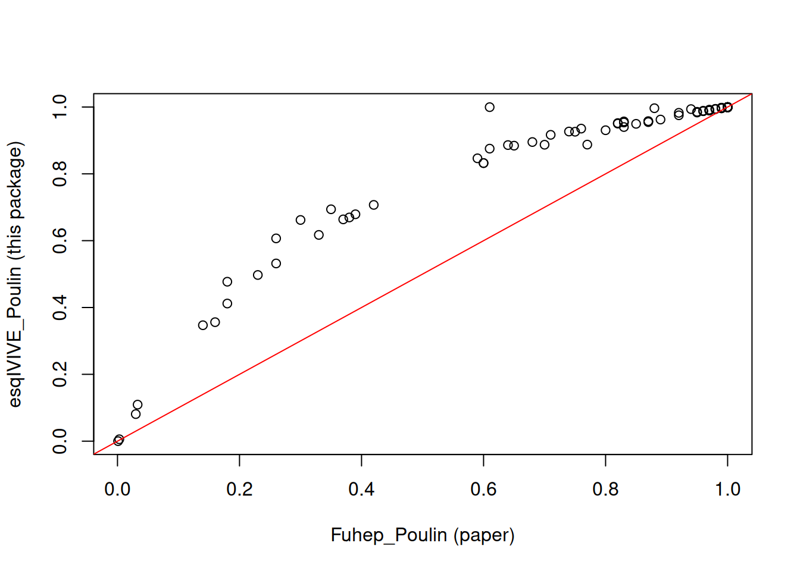
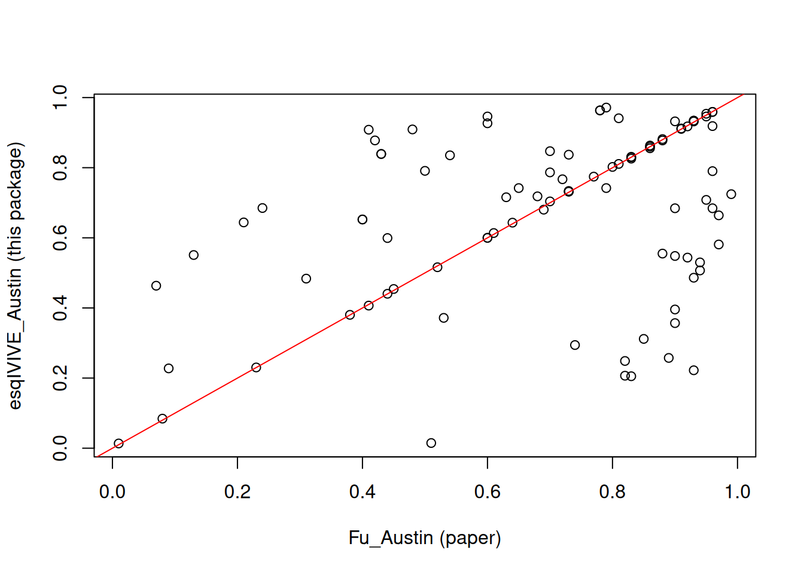
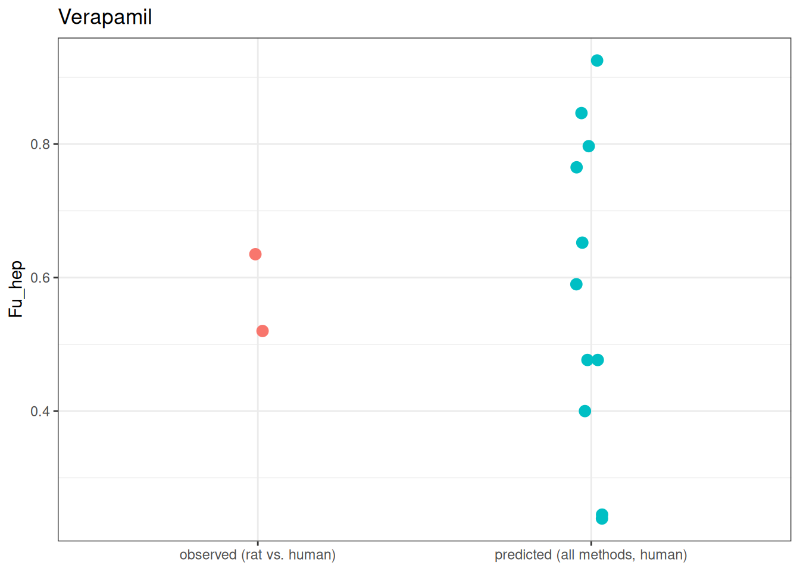
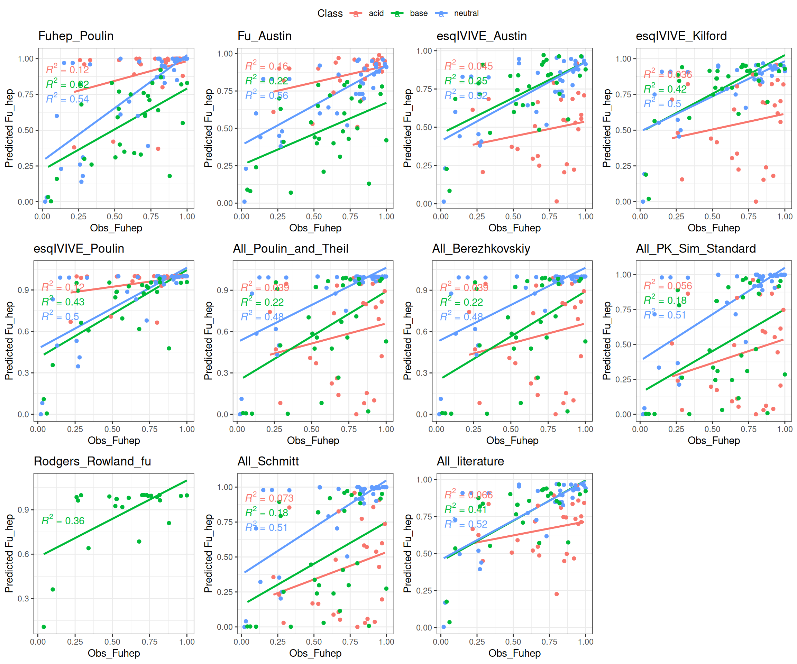

# Compare algorithms to predict Fu_hep

## Theory

Fraction unbound in a hepatocyte incubation (Fu_hep) is estimated using
the same physicochemical partitioning principles as Fu_mic (see the
“Evaluate Fu_mic” vignette for the full derivations); the
hepatocyte-specific implementations differ mainly in which literature
regressions apply and in the cell composition assumptions used to derive
the in vitro compartment volumes.

#### Austin et al 2002 (hepatocyte form)

Uses the same functional form as the microsomal regression but with
coefficients recalibrated for hepatocyte concentration (in million
cells/mL) rather than microsomal protein concentration.

#### Kilford et al 2008

A hepatocyte-specific regression (there is no microsomal equivalent in
this package), scaling the Hallifax and Houston microsomal correction to
hepatocyte cell volume.

``` math
fu_{inc} = \frac{1}{1+ 125 \cdot VR \cdot 10^{0.072\cdot \log \left( \frac{P}{D} \right)^2 +0.067\cdot\log \left( \frac{P}{D} \right)-1.126}}
```

where VR is the cell volume to incubation volume ratio.

#### Poulin

Same equation as for microsomes, but the neutral lipid and (for strong
bases) acidic phospholipid concentrations are derived from hepatocyte,
not microsomal, composition.

#### Rodgers & Rowland

Same restriction as for Fu_mic: only implemented for strong bases
(ionization class “base” with pKa \> 7), since it is calibrated from the
compound’s blood-cell partitioning (fraction unbound in plasma and
blood:plasma ratio).

#### All_literature

Average of this package’s own Austin, Kilford and Poulin predictions.

We used the Obs_Fuhep from this dataset to evaluate the predictions.
Unlike the microsomal dataset, this one includes compound-specific
fraction unbound in plasma (`fuP`) and blood:plasma ratio (`RBP`) for a
subset of the base compounds - these are used for Poulin’s strong-base
branch and for Rodgers & Rowland wherever available, instead of a
generic literature default.

#### Calculate Fu_hep for all

    Rodgers & Rowland computed for 24 of 95 compounds (strong bases with known fuP/RBP only)

          Compound Species LogP25C LogP37C LogD37C  pKa Class fuP RBP Pea
    1   Bumetamide     Rat    3.21    3.32    0.42  4.5  acid  NA  NA  NA
    2 Cerivastatin     Rat    4.54    4.65     1.8 4.55  acid  NA  NA  NA
    3    Glyburide     Rat    4.29    4.40    2.29  5.3  acid  NA  NA  NA
    4    Oxaprozin     Rat    4.81    4.92    1.72  4.2  acid  NA  NA  NA
    5 Quinotoplast     Rat    1.46    1.57    0.66 6.55  acid  NA  NA  NA
    6 Troglitazone     Rat     3.6    3.70    3.71 10.8  acid  NA  NA  NA
      Cell_concentration.10_6cells.mL. Obs_Fuhep Fuhep_Poulin Fu_Austin
    1                                1    0.9300         1.00      0.94
    2                                1    0.6800         0.96      0.82
    3                                1    0.6350         0.89      0.74
    4                                1    0.8525         0.97      0.83
    5                              0.5    0.9400         1.00      0.96
    6                              0.5    0.2200         0.38      0.61
      esqIVIVE_Austin esqIVIVE_Kilford esqIVIVE_Poulin All_Poulin_and_Theil
    1       0.5298979        0.6733039       0.9994825           0.77584983
    2       0.2487592        0.2245463       0.9877335           0.13936190
    3       0.2942186        0.3045536       0.9624477           0.22357288
    4       0.2052302        0.1532422       0.9897681           0.08000397
    5       0.9186909        0.9570988       0.9995470           0.99740217
    6       0.6136992        0.7141118       0.6694635           0.74239262
      All_Berezhkovskiy All_PK_Sim_Standard Rodgers_Rowland_fu All_Schmitt
    1        0.77584983          0.55221865                 NA  0.53809866
    2        0.13936190          0.05453333                 NA  0.05166497
    3        0.22357288          0.09302732                 NA  0.08792997
    4        0.08000397          0.03004464                 NA  0.02844196
    5        0.99740217          0.99286291                 NA  0.99175497
    6        0.74239262          0.50680789                 NA  0.35592270
      All_literature
    1      0.7342281
    2      0.4870130
    3      0.5204066
    4      0.4494135
    5      0.9584456
    6      0.6657582

This dataset also gives two literature-reported prediction columns
(`Fuhep_Poulin`, `Fu_Austin`), letting us sanity-check this package’s
own `esqIVIVE_Poulin`/`esqIVIVE_Austin` against the originally reported
values.

``` r

plot(testFuHepData$Fuhep_Poulin, testFuHepData$esqIVIVE_Poulin,
  xlab = "Fuhep_Poulin (paper)", ylab = "esqIVIVE_Poulin (this package)"
)
abline(0, 1, col = "red")
```



``` r

plot(testFuHepData$Fu_Austin, testFuHepData$esqIVIVE_Austin,
  xlab = "Fu_Austin (paper)", ylab = "esqIVIVE_Austin (this package)"
)
abline(0, 1, col = "red")
```



Poulin agrees closely with the paper’s own values (points fall near the
identity line). Austin does not - this package’s
[`calculate_fu_hep_austin()`](https://esqlabs.github.io/esqIVIVE/reference/calculate_fu_hep_austin.md)
systematically predicts lower Fu than the paper’s `Fu_Austin` column,
which is worth investigating further (e.g. whether the coefficients or
cell-concentration assumptions used here match the original
hepatocyte-specific regression) before relying on it.

Verapamil appears twice in this dataset (rat and human), giving a small
comparison between the spread across our prediction methods and the
spread between the two species’ observed values.

``` r

verapamil_rows <- testFuHepData[testFuHepData$Compound == "Verapamil", ]
human_row <- verapamil_rows[verapamil_rows$Species == "Human", ]
predicted_cols <- c("Fuhep_Poulin", "Fu_Austin", QSAR_colnames)

verapamil_df <- data.frame(
  fu = c(as.double(human_row[1, predicted_cols]), verapamil_rows$Obs_Fuhep),
  type = c(
    rep("predicted (all methods, human)", length(predicted_cols)),
    rep("observed (rat vs. human)", nrow(verapamil_rows))
  )
)

ggplot(verapamil_df, aes(x = type, y = fu, color = type)) +
  geom_jitter(width = 0.05, height = 0, size = 3) +
  labs(x = NULL, y = "Fu_hep", title = "Verapamil") +
  theme_bw() +
  theme(legend.position = "none")
```



### Plots

``` r

# First 2 columns are the original papers' own reported predictions (from the
# dataset itself); the rest are computed by this package above.
plot_cols <- c("Fuhep_Poulin", "Fu_Austin", QSAR_colnames)

make_fu_plot <- function(data, ycol) {
  ggplot(data, aes(x = Obs_Fuhep, y = .data[[ycol]], col = Class)) +
    geom_smooth(method = "lm", se = FALSE) +
    geom_point() +
    theme_bw() +
    labs(title = ycol, y = "Predicted Fu_hep") +
    stat_regline_equation(aes(label = after_stat(rr.label)))
}

fu_plots <- lapply(plot_cols, make_fu_plot, data = testFuHepData)
ggarrange(plotlist = fu_plots, common.legend = TRUE)
```

    `geom_smooth()` using formula = 'y ~ x'
    `geom_smooth()` using formula = 'y ~ x'
    `geom_smooth()` using formula = 'y ~ x'
    `geom_smooth()` using formula = 'y ~ x'

    Warning: Removed 1 row containing non-finite outside the scale range
    (`stat_smooth()`).

    Warning: Removed 1 row containing non-finite outside the scale range
    (`stat_regline_equation()`).

    Warning: Removed 1 row containing missing values or values outside the scale range
    (`geom_point()`).

    `geom_smooth()` using formula = 'y ~ x'

    Warning: Removed 1 row containing non-finite outside the scale range
    (`stat_smooth()`).

    Warning: Removed 1 row containing non-finite outside the scale range
    (`stat_regline_equation()`).

    Warning: Removed 1 row containing missing values or values outside the scale range
    (`geom_point()`).

    `geom_smooth()` using formula = 'y ~ x'

    Warning: Removed 6 rows containing non-finite outside the scale range
    (`stat_smooth()`).

    Warning: Removed 6 rows containing non-finite outside the scale range
    (`stat_regline_equation()`).

    Warning: Removed 6 rows containing missing values or values outside the scale range
    (`geom_point()`).

    `geom_smooth()` using formula = 'y ~ x'

    Warning: Removed 1 row containing non-finite outside the scale range
    (`stat_smooth()`).

    Warning: Removed 1 row containing non-finite outside the scale range
    (`stat_regline_equation()`).

    Warning: Removed 1 row containing missing values or values outside the scale range
    (`geom_point()`).

    `geom_smooth()` using formula = 'y ~ x'

    Warning: Removed 1 row containing non-finite outside the scale range
    (`stat_smooth()`).

    Warning: Removed 1 row containing non-finite outside the scale range
    (`stat_regline_equation()`).

    Warning: Removed 1 row containing missing values or values outside the scale range
    (`geom_point()`).

    `geom_smooth()` using formula = 'y ~ x'

    Warning: Removed 1 row containing non-finite outside the scale range
    (`stat_smooth()`).

    Warning: Removed 1 row containing non-finite outside the scale range
    (`stat_regline_equation()`).

    Warning: Removed 1 row containing missing values or values outside the scale range
    (`geom_point()`).

    `geom_smooth()` using formula = 'y ~ x'

    Warning: Removed 71 rows containing non-finite outside the scale range
    (`stat_smooth()`).

    Warning: Removed 71 rows containing non-finite outside the scale range
    (`stat_regline_equation()`).

    Warning: Removed 71 rows containing missing values or values outside the scale range
    (`geom_point()`).

    `geom_smooth()` using formula = 'y ~ x'

    Warning: Removed 1 row containing non-finite outside the scale range
    (`stat_smooth()`).

    Warning: Removed 1 row containing non-finite outside the scale range
    (`stat_regline_equation()`).

    Warning: Removed 1 row containing missing values or values outside the scale range
    (`geom_point()`).

    `geom_smooth()` using formula = 'y ~ x'

    Warning: Removed 6 rows containing non-finite outside the scale range
    (`stat_smooth()`).

    Warning: Removed 6 rows containing non-finite outside the scale range
    (`stat_regline_equation()`).

    Warning: Removed 6 rows containing missing values or values outside the scale range
    (`geom_point()`).



### Error Table

For each method and each chemical class (acid/base/neutral), we
calculate:

- `percent_within_2fold` / `percent_within_5fold`: the percentage of
  predictions within 2-fold / 5-fold of the observed value
- `afe_method` (Average Fold Error) and `aafe_method` (Average Absolute
  Fold Error): overall magnitude of error, direction-agnostic
- `bias_fold`: the signed geometric-mean fold error - values \>1
  indicate the method tends to over-predict on average, \<1
  under-predict
- `rmse`: root mean squared error, on the same 0-1 scale as Fu
- `r2`: Pearson r², the strength of the *linear* relationship between
  predicted and observed
- `spearman_rho`: Spearman rank correlation, robust to nonlinearity and
  outliers
- `ccc`: Lin’s Concordance Correlation Coefficient - penalizes
  systematic deviation from the line of identity (y = x), not just
  correlation

Rodgers & Rowland only has predictions for strong bases with known
fuP/RBP, so all metrics for that method are computed only over its
available (non-`NA`) subset - `n` reports how many compounds contributed
to each row.

``` r

# All metrics below are computed only on rows where both observed and
# predicted are finite, since Rodgers & Rowland only has results for a subset
# of strong bases and would otherwise silently drop out of every summary.
complete_pairs <- function(observed, predicted) {
  ok <- is.finite(observed) & is.finite(predicted)
  list(observed = observed[ok], predicted = predicted[ok])
}

percent_within_fold <- function(observed, predicted, fold) {
  cp <- complete_pairs(observed, predicted)
  mean(cp$predicted >= cp$observed / fold & cp$predicted <= cp$observed * fold) * 100
}

afe <- function(observed, predicted) {
  cp <- complete_pairs(observed, predicted)
  mean(abs(cp$predicted / cp$observed))
}

aafe <- function(observed, predicted) {
  cp <- complete_pairs(observed, predicted)
  mean(abs(log10(cp$predicted / cp$observed)))
}

bias_fold <- function(observed, predicted) {
  cp <- complete_pairs(observed, predicted)
  10^(mean(log10(cp$predicted / cp$observed)))
}

rmse <- function(observed, predicted) {
  cp <- complete_pairs(observed, predicted)
  sqrt(mean((cp$predicted - cp$observed)^2))
}

pearson_r2 <- function(observed, predicted) {
  cp <- complete_pairs(observed, predicted)
  if (length(cp$observed) < 3) {
    return(NA_real_)
  }
  cor(cp$observed, cp$predicted, method = "pearson")^2
}

spearman_rho <- function(observed, predicted) {
  cp <- complete_pairs(observed, predicted)
  if (length(cp$observed) < 3) {
    return(NA_real_)
  }
  cor(cp$observed, cp$predicted, method = "spearman")
}

lin_ccc <- function(observed, predicted) {
  cp <- complete_pairs(observed, predicted)
  if (length(cp$observed) < 2) {
    return(NA_real_)
  }
  mean_o <- mean(cp$observed)
  mean_p <- mean(cp$predicted)
  var_o <- mean((cp$observed - mean_o)^2)
  var_p <- mean((cp$predicted - mean_p)^2)
  covar <- mean((cp$observed - mean_o) * (cp$predicted - mean_p))
  (2 * covar) / (var_o + var_p + (mean_o - mean_p)^2)
}

error_table <- list()

for (predi in plot_cols) {
  error_table[[predi]] <- testFuHepData %>%
    group_by(Class) %>%
    summarize(
      n = sum(is.finite(.data[[predi]])),
      percent_within_2fold = percent_within_fold(Obs_Fuhep, .data[[predi]], 2),
      percent_within_5fold = percent_within_fold(Obs_Fuhep, .data[[predi]], 5),
      afe_method = afe(Obs_Fuhep, .data[[predi]]),
      aafe_method = aafe(Obs_Fuhep, .data[[predi]]),
      bias_fold = bias_fold(Obs_Fuhep, .data[[predi]]),
      rmse = rmse(Obs_Fuhep, .data[[predi]]),
      r2 = pearson_r2(Obs_Fuhep, .data[[predi]]),
      spearman_rho = spearman_rho(Obs_Fuhep, .data[[predi]]),
      ccc = lin_ccc(Obs_Fuhep, .data[[predi]]),
      .groups = "drop"
    )
}

# error_table[["All_literature"]]
```
