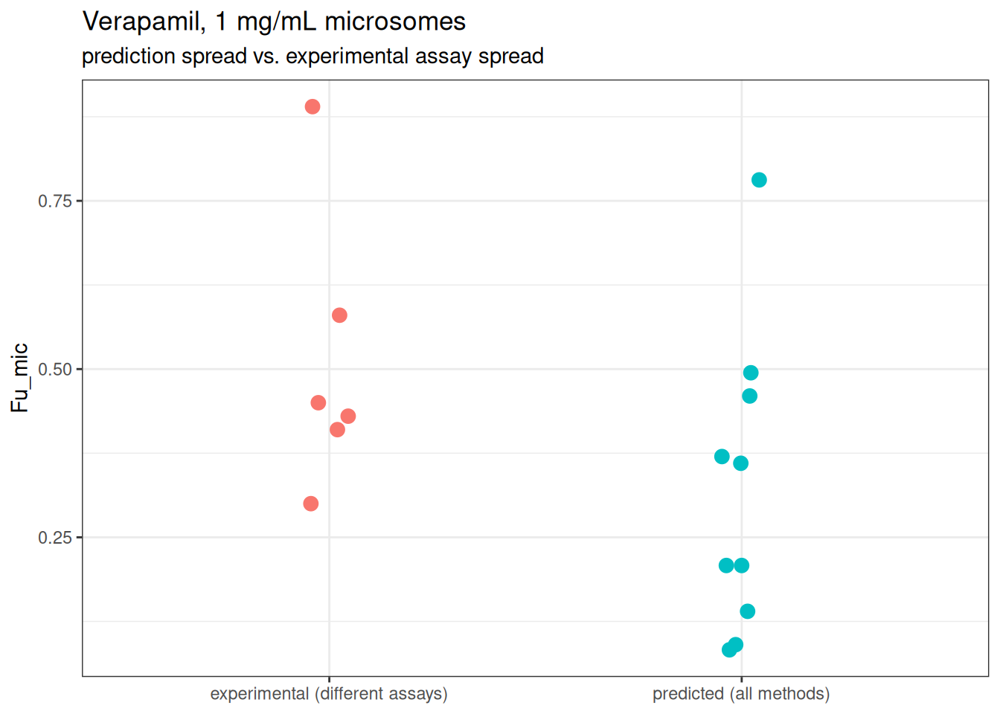
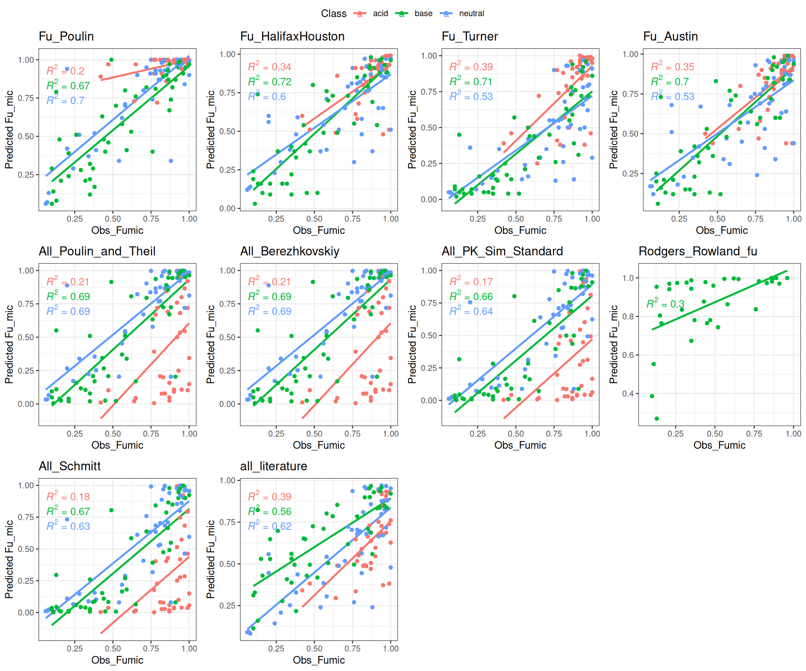

# Compare algorithms to predict Fu

## Theory

Quarto enables you to weave together content and executable code into a
finished document. To learn more about Quarto see <https://quarto.org>.

Some algorithms are purely empirical regressions

#### Austin et al 2002

``` math
fu_{inc} = 1 \cdot C \cdot 10^{0.56 \log \left( \frac{P}{D} \right) - 1.41} + 1
```

#### Hallifax and Houston 2006

``` math
fu_{inc} = \frac{1}{1+ C \cdot 10^{0.072\cdot \log \left( \frac{P}{D} \right)^2 +0.067\cdot\log \left( \frac{P}{D} \right)-1.126}}
```

#### Turner

For neutral
``` math
fu_{inc} = \frac{1}{1+ C \cdot 10^{0.46\cdot \log P-1.51}}
```
For predominantly ionized bases

``` math
fu_{inc} = \frac{1}{1+ C \cdot 10^{0.58\cdot \log P-2.02}}
```
For predominantly ionized acid
``` math
fu_{inc} = \frac{1}{1+ C \cdot 10^{0.2\cdot \log P-1.54}}
```
**Poulin**

``` math
fu_{inc} = \frac{1}{Fw+\frac{Pnla\cdot Fnlm}{1+Im}}
```
Where Fw is the fraction ofwater is the system( very close to 1), Im is
the ionization factor, Pnla=neutral lipids partition and Fnlm the
fraction of fractional volume of neutral lipids in medium.

For basic chemicals the affintiy to acidic phospholipids is also
accounted.Here Papla is the partition to acidic phospholipids and Faplm
is the fraction of acidic phospholipids.

``` math
fu_{inc} = \frac{1}{Fw+\frac{Pnla\cdot Fnlm+Im\cdot Papla\cdot Faplm}{1+Im}}
```
Pnla is parameterized with logPow at 37 C. Since logKow values are often
for 20 °C, the authors used a linear regression that corrects for the
temperature difference. Papla is parameterized based on a similar
regression from Rodgers and Rowland where they use the red blood cells
plasma partition coefficient and fraction unbound in plasma.

**Rodgers & Rowland**

Adapts the same mechanistic (neutral lipid / neutral and acidic
phospholipid) partitioning approach Rodgers & Rowland use for
whole-organ tissue partitioning to the in vitro incubation compartments
instead. The acidic-phospholipid affinity constant is calibrated from
the compound’s blood-cell partitioning (fraction unbound in plasma and
blood:plasma ratio), so it is currently only implemented for strong
bases (ionization class “base” with pKa \> 7) - for every other class
PK-Sim itself switches to a different, protein-binding-based term that
this package does not implement yet.

**all_literature**

A simple average of the four empirical/literature regressions above
(Poulin, Hallifax and Houston, Austin, Turner), computed with this
package’s own implementation of each rather than the papers’ originally
reported values.

We used the Fu_mic from this dataset to evaluate the predictions

#### alculate Fu_mic for all

    Rodgers & Rowland computed for 34 of 132 compounds (strong bases only)

          Compound LogP25C LogP37C LogD37C  pKa Class Pea Cp.mg.mL. Obs_Fumic
    1   Bumetanide    3.21    3.32    0.42  4.5  acid   –      1.00      0.92
    2   Bumetanide    3.21    3.32    0.42  4.5  acid   –      0.25      0.95
    3   Bumetanide    3.21    3.32    0.42  4.5  acid   –      4.00      0.83
    4 Cerivastatin    4.54    4.65    1.80 4.55  acid   –      1.00      0.65
    5 Cerivastatin    4.54    4.65    1.80 4.55  acid   –      0.25      0.87
    6 Cerivastatin    4.54    4.65    1.80 4.55  acid   –      4.00      0.42
      Fu_Poulin Fu_HalifaxHouston Fu_Austin Fu_Turner All_Poulin_and_Theil
    1      1.00              0.92      0.88      0.94           0.49970194
    2      1.00              0.98      0.97      0.98           0.79980917
    3      1.00              0.75      0.65      0.79           0.19980931
    4      0.97              0.86      0.80      0.72           0.04465329
    5      0.99              0.96      0.94      0.91           0.15751277
    6      0.89              0.60      0.50      0.39           0.01155014
      All_Berezhkovskiy All_PK_Sim_Standard Rodgers_Rowland_fu All_Schmitt
    1        0.49970194         0.274379030                 NA 0.250947454
    2        0.79980917         0.601993194                 NA 0.572664056
    3        0.19980931         0.086367916                 NA 0.077282190
    4        0.04465329         0.017378575                 NA 0.015423378
    5        0.15751277         0.066069707                 NA 0.058965184
    6        0.01155014         0.004402019                 NA 0.003900969
      all_literature
    1      0.6762981
    2      0.8479296
    3      0.4918986
    4      0.4894300
    5      0.6376371
    6      0.3410890

Mind that experimental values also have intrinsic variability and Wang
et al 2024, it is described how chemicals with lower Fu_microsomes tend
to have higher coeficients of variation. Specifically for Verapamil 1
mg/mL microsomes concentration different analytical methods 0.43 with
RED device, 0.58 wuth ultrafiltration, 0.41 with HLM-beads, 0.45 with
Ultracentrifugation and 0.89 Transil and 0.3 with linear extrapolation
stability assay.

``` r

verapamil_row <- which(testFuData$Compound == "Verapamil")[4]
verapamil_predictions <- as.double(testFuData[verapamil_row, 10:ncol(testFuData)])

verapamil_df <- data.frame(
  fu = c(verapamil_predictions, c(0.43, 0.58, 0.41, 0.45, 0.89, 0.3)),
  type = c(
    rep("predicted (all methods)", length(verapamil_predictions)),
    rep("experimental (different assays)", 6)
  )
)

ggplot(verapamil_df, aes(x = type, y = fu, color = type)) +
  geom_jitter(width = 0.05, height = 0, size = 3) +
  labs(
    x = NULL, y = "Fu_mic",
    title = "Verapamil, 1 mg/mL microsomes",
    subtitle = "prediction spread vs. experimental assay spread"
  ) +
  theme_bw() +
  theme(legend.position = "none")
```



### Plots

``` r

# First 4 columns are the original papers' own reported predictions (from the
# dataset itself); the rest are computed by this package above.
plot_cols <- c(
  "Fu_Poulin", "Fu_HalifaxHouston", "Fu_Turner", "Fu_Austin",
  method_colnames
)

make_fu_plot <- function(data, ycol) {
  ggplot(data, aes(x = Obs_Fumic, y = .data[[ycol]], col = Class)) +
    geom_smooth(method = "lm", se = FALSE) +
    geom_point() +
    theme_bw() +
    labs(title = ycol, y = "Predicted Fu_mic") +
    stat_regline_equation(aes(label = after_stat(rr.label)))
}

fu_plots <- lapply(plot_cols, make_fu_plot, data = testFuData)
ggarrange(plotlist = fu_plots, common.legend = TRUE)
```

    `geom_smooth()` using formula = 'y ~ x'
    `geom_smooth()` using formula = 'y ~ x'
    `geom_smooth()` using formula = 'y ~ x'
    `geom_smooth()` using formula = 'y ~ x'

    Warning: Removed 1 row containing non-finite outside the scale range
    (`stat_smooth()`).

    Warning: Removed 1 row containing non-finite outside the scale range
    (`stat_regline_equation()`).

    Warning: Removed 1 row containing missing values or values outside the scale range
    (`geom_point()`).

    `geom_smooth()` using formula = 'y ~ x'
    `geom_smooth()` using formula = 'y ~ x'
    `geom_smooth()` using formula = 'y ~ x'
    `geom_smooth()` using formula = 'y ~ x'
    `geom_smooth()` using formula = 'y ~ x'

    Warning: Removed 98 rows containing non-finite outside the scale range
    (`stat_smooth()`).

    Warning: Removed 98 rows containing non-finite outside the scale range
    (`stat_regline_equation()`).

    Warning: Removed 98 rows containing missing values or values outside the scale range
    (`geom_point()`).

    `geom_smooth()` using formula = 'y ~ x'
    `geom_smooth()` using formula = 'y ~ x'



### Error Table

For each method and each chemical class (acid/base/neutral), we
calculate:

- `percent_within_2fold` / `percent_within_5fold`: the percentage of
  predictions within 2-fold / 5-fold of the observed value
- `afe_method` (Average Fold Error) and `aafe_method` (Average Absolute
  Fold Error): overall magnitude of error, direction-agnostic
- `bias_fold`: the signed geometric-mean fold error - values \>1
  indicate the method tends to over-predict on average, \<1
  under-predict; this complements AAFE, which only captures magnitude,
  not direction
- `rmse`: root mean squared error, on the same 0-1 scale as Fu, easy to
  interpret in absolute terms
- `r2`: Pearson r², the strength of the *linear* relationship between
  predicted and observed
- `spearman_rho`: Spearman rank correlation, robust to nonlinearity and
  outliers - useful when what matters is whether the method ranks
  compounds correctly rather than matching the exact scale
- `ccc`: Lin’s Concordance Correlation Coefficient - unlike r² this
  penalizes any systematic deviation from the line of identity (y = x),
  so a method can be well correlated (high r²) yet still score poorly
  here if it is systematically biased or mis-scaled

Rodgers & Rowland only has predictions for strong bases (see above), so
all metrics for that method are computed only over its available
(non-`NA`) subset - `n` reports how many compounds contributed to each
row.

``` r

# All metrics below are computed only on rows where both observed and
# predicted are finite, since Rodgers & Rowland only has results for strong
# bases and would otherwise silently drop out of every summary.
complete_pairs <- function(observed, predicted) {
  ok <- is.finite(observed) & is.finite(predicted)
  list(observed = observed[ok], predicted = predicted[ok])
}

# % within fold function
percent_within_fold <- function(observed, predicted, fold) {
  cp <- complete_pairs(observed, predicted)
  mean(cp$predicted >= cp$observed / fold & cp$predicted <= cp$observed * fold) * 100
}

# Average Fold Error (AFE) function
afe <- function(observed, predicted) {
  cp <- complete_pairs(observed, predicted)
  mean(abs(cp$predicted / cp$observed))
}

# Average Absolute Fold Error (AAFE) function
aafe <- function(observed, predicted) {
  cp <- complete_pairs(observed, predicted)
  mean(abs(log10(cp$predicted / cp$observed)))
}

# Bias: signed geometric-mean fold error
bias_fold <- function(observed, predicted) {
  cp <- complete_pairs(observed, predicted)
  10^(mean(log10(cp$predicted / cp$observed)))
}

# RMSE: average error magnitude on the same 0-1 scale as Fu
rmse <- function(observed, predicted) {
  cp <- complete_pairs(observed, predicted)
  sqrt(mean((cp$predicted - cp$observed)^2))
}

# Pearson r^2: strength of the linear relationship
pearson_r2 <- function(observed, predicted) {
  cp <- complete_pairs(observed, predicted)
  if (length(cp$observed) < 3) {
    return(NA_real_)
  }
  cor(cp$observed, cp$predicted, method = "pearson")^2
}

# Spearman rho: strength of the rank relationship
spearman_rho <- function(observed, predicted) {
  cp <- complete_pairs(observed, predicted)
  if (length(cp$observed) < 3) {
    return(NA_real_)
  }
  cor(cp$observed, cp$predicted, method = "spearman")
}

# Lin's Concordance Correlation Coefficient: penalizes deviation from the
# line of identity (y = x), not just correlation
lin_ccc <- function(observed, predicted) {
  cp <- complete_pairs(observed, predicted)
  if (length(cp$observed) < 2) {
    return(NA_real_)
  }
  mean_o <- mean(cp$observed)
  mean_p <- mean(cp$predicted)
  var_o <- mean((cp$observed - mean_o)^2)
  var_p <- mean((cp$predicted - mean_p)^2)
  covar <- mean((cp$observed - mean_o) * (cp$predicted - mean_p))
  (2 * covar) / (var_o + var_p + (mean_o - mean_p)^2)
}

error_table <- list()

for (predi in plot_cols) {
  error_table[[predi]] <- testFuData %>%
    group_by(Class) %>%
    summarize(
      n = sum(is.finite(.data[[predi]])),
      percent_within_2fold = percent_within_fold(Obs_Fumic, .data[[predi]], 2),
      percent_within_5fold = percent_within_fold(Obs_Fumic, .data[[predi]], 5),
      afe_method = afe(Obs_Fumic, .data[[predi]]),
      aafe_method = aafe(Obs_Fumic, .data[[predi]]),
      bias_fold = bias_fold(Obs_Fumic, .data[[predi]]),
      rmse = rmse(Obs_Fumic, .data[[predi]]),
      r2 = pearson_r2(Obs_Fumic, .data[[predi]]),
      spearman_rho = spearman_rho(Obs_Fumic, .data[[predi]]),
      ccc = lin_ccc(Obs_Fumic, .data[[predi]]),
      .groups = "drop"
    )
}

# error_table[["all_literature"]]
```

Calculate liver partitioning for all is it more proportional to any
specific ..

steps

\#import from diana htpbk

\#make table to save values row chemicals and col the different
partitions

\#add parameeters, logP and pKa class as input parameters as loop and
get Kliver/water for different partitions coefficents

\#Compare the proportion of Fu to Kp ..
